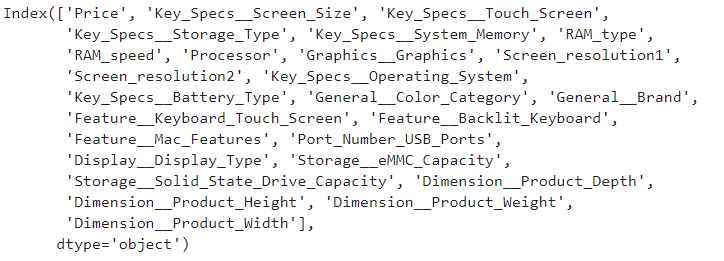
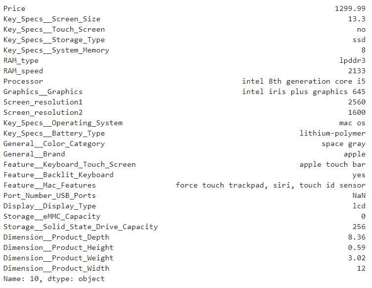
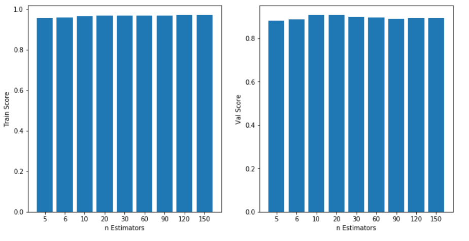
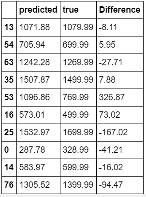

# Data Science Final Project

## Thành viên nhóm

-   Nguyễn Thanh Tuấn 1612744
-   Hoàng Xuân Trường 1612899

## Tệp 
- __Slide__ :https://docs.google.com/presentation/d/1Nq5LlfNVe-uooOjxUx5RLwBN-Aha2yDpy-C7NqmzX9Y/edit?usp=sharing

## Ý tưởng:

-   Dự đoán giá laptop, tablet từ các thông tin cấu thành (hãng, CPU, ram, gpu,...)
    -   Input: các thông tin của mấy tính: hãng, CPU, ram, ...
    -   Output: Giá sản phẩm.

## Ứng dụng:

-   Người dùng: Gợi ý giá sản phẩm cho người dùng khi người dùng muốn mua 1 sản phẩm laptop, tablet với cấu hình mong muốn.
-   *Model dự đoán giá này có gì đặc biệt:*

> Model sẽ giúp người dùng tự build sản phẩm từ những linh kiện khác nhau nên người dùng không cần phải tra cứu từng linh kiện để lắp ráp. Người dùng có thể tự tìm kiếm các link kiện nhưng đó là với người dùng có kiến thức nhất định về các cấu hình máy (loại nào, hãng nào, thế hệ nào,..). Vì vậy, mô hình sẽ tốt cho *(a)* tiết kiệm thời gian tìm kiếm từng thành phần cấu hình laptop một cách chi tiết nhưng vẫn có thể có chi phí tối ưu và *(b)* dễ sử dụng với những người dùng có không có kiến thức chi tiết về cấu hình laptop đã có sẵn trong bộ dữ liệu
    

## Dữ liệu:

-   Lấy từ 2 nguồn: Bestbuy và Amazon
-   API: Không lấy được đủ thông tin -> request_html và selenium
-   Check tính hợp lệ của dữ liệu:
    -   https://www.amazon.com/robots.txt
    -   https://www.bestbuy.com/robots.txt
-   Dữ liệu hiện tại:
    -   Bestbuy: hơn 1000 items
    -   Amazon: hơn 5000 items
-   Vấn đề hiện tại:
    -   Chọn thuộc tính phù hợp
    -   Thuộc tính sản phẩm 2 nguồn khác nhau, format khác nhau, cần đồng bộ (khó ghép lại) -> giải quyết: ????
    -   Dữ liệu rác: Thuộc tính không chuẩn, thiếu

### CrThông tin dữ liệu

Một số thông tin cơ bản được crawl:

-   Price: giá của laptop
-   Screen size: kích thước của màn hình
-   RAM: bộ nhớ RAM
-   Brand Name: hãng laptop
-   Item Weigth: Khối lượng
-   Operating System: Hệ điều hành của máy
-   Color: màu của sản phẩm
-   Processor Brand: hãng sản xuất CPU (Intel, AMD, Mediatek,..)
-   Processor Count: số lượng nhân
-   Computer Memory Type: Loại RAM (DDR3, DDR4,...)
-   ...
~ Tất cả: 168 thông tin (Đối với dữ liệu của BestBuy).

### Preprocessing
Dữ liệu được chọn là __BestBuy__ (bỏ qua __Amazon__ để tránh nhiễu).

Chọn một số thuộc tính được để tiền xử lý. Các thuộc tính khác do tỷ lệ thiếu quá cao nên sẽ bị bỏ qua. Các thuộc tính tiêu biểu:
- Giá
- Kích thước màn hình
- Độ phân giải
- Ram
- Chip xử lý
- Bộ nhớ
- Kích thước máy
- Khối lượng
- ...

~ 26 thuộc tính

#### Thuộc tính thiếu

Các thuộc tính thiếu được thay thế bởi các giá trị trung bình (cho numeric), giá trị có tầng suất xuất hiện nhiều nhất (cho object/string) tùy vào trường nào đang xét sẽ có các giá trị được chọn phù hợp nhất với thuộc tính đó. 

#### Dataset

- Dữ liệu chưa được clean và preproccessing (file `*.csv`) nằm trong thư mục `/dataset/Amazon` cho dữ liệu của Amazon và `/dataset/BestBuy` cho dữ liệu của trang web Bestbuy.
- Dữ liệu đã qua xử lý nằm ở thư mục `preprocessing`, script xử lý là các file `preprocessing.ipynb`
- Nhóm thực hiện chia dữ liệu thành 2 tập chính train (90%) và test (10%).

Các thuộc tính được rút trích:

Một mẫu đại diện:

### Model

- Tập dữ liệu train được chia thành 2 tập chính: phần train (90% tập train, phục vụ cho quá trình train mô hình), phần validation (10% tập train, phục vụ đánh giá mô hình trong quá trình train).
- Nhóm áp dụng một vài thuật toán trên tập sữ liệu đang có. Kết quả đạt tốt nhất với thuật toán Randomforest:
- Thử các trường hợp n_estimators khác nhau, n_estimators=10 (và 20) cho kết quả tương đối tốt. Tuy nhiên, nhóm chọn n_estimators=10 cho mô hình cuối cùng.
- Độ chính xác trên tập train khoảng 96%, tập validation khoảng 90%.

 
### Testing.

- Nhóm thực hiện test trên 10% dữ liệu đã chia từ trước.
- Model chọn: Randomforest - n_estimator=10.
- Độ chính xác trên tập test: ~85%.
- Một số đánh giá:
	- Dữ liệu hơi ít, nên mô hình thực sự đủ để predict giá gần với giá gốc.
	- Các items có giá càng cao, thì sự chênh lệch giá predict và giá thực tế càng cao (Một phần do số lượng các items có giá cao trong tổng dữ liệu khá ít).
